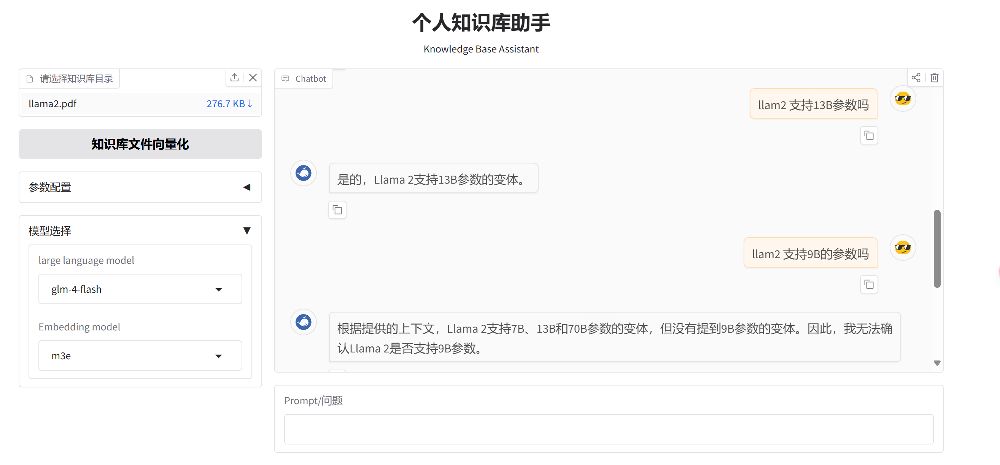

# ai-knowledge-base-assistant
AI RAG for personal AI knowledge base assistant (only used for study)
0.1.0 version
## 个人知识库助手项目
```
LLM + Embedding + ChromaDB + Gradio

1. 目前支持OpenAI和ZHUIAI的LLM
2. 支持pdf、md、docx、txt等格式的文件
3. 支持OpenAI和智普的Embedding模型
4. windows环境下测试通过
5. 后续测试其他LLM、Embedding模型和向量库
```
**演示界面**


**Installation:**
- The Poetry package manager is required for installation. [Poetry Installation](https://python-poetry.org/docs/#installation) Depending on your environment, this might work:

```
pip install poetry
```

- A .env file with a OPENAI_API_KEY is required to run the workflow. See the .env.sample file as an example.

```
git clone https://github.com/andrewyng/translation-agent.git
cd translation-agent
poetry install
poetry shell # activates virtual environment
```

**Running**

```
python serve/run_gradio.py

http://127.0.0.1:9990

```
## NOTE
```
有些信息来自网上，有些地方有问题，仅供参考学习用，可自行下载学习和调试。
only used for study！！！
```

## 其他
```
1. 后续优先支持DeepSeek
2. 继续把一些接口更新到最新
3. 支持Milvus向量库
```